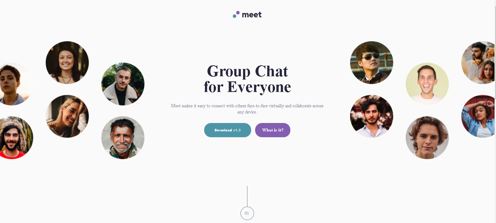
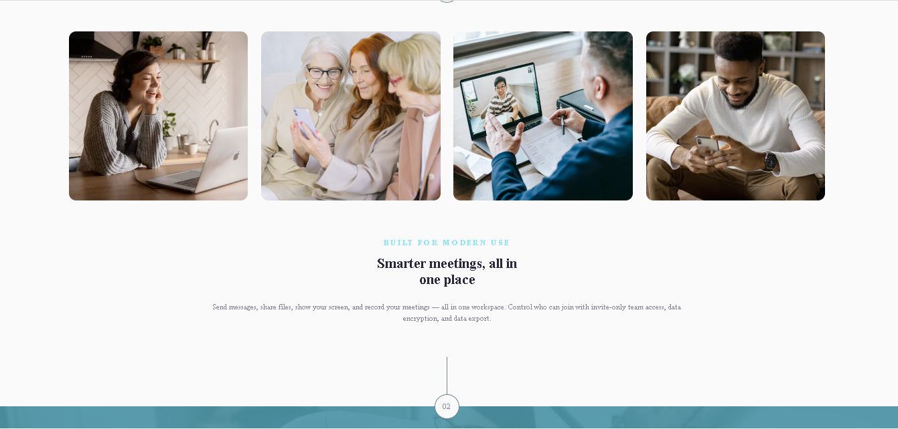
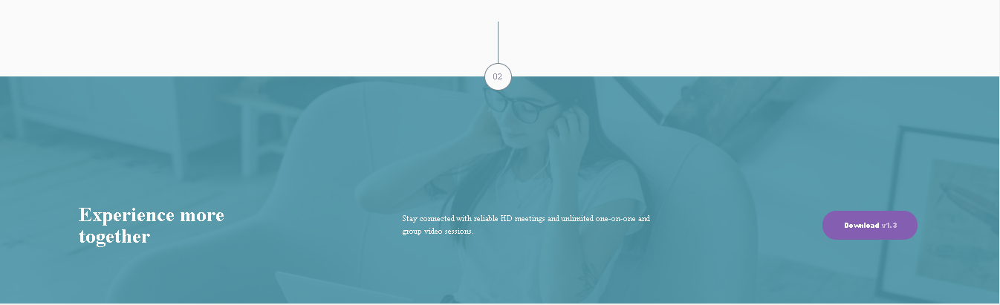

# Frontend Mentor - Meet landing page solution

This is a solution to the [Meet landing page challenge on Frontend Mentor](https://www.frontendmentor.io/challenges/meet-landing-page-rbTDS6OUR). Frontend Mentor challenges help you improve your coding skills by building realistic projects. 

## Table of contents

- [Overview](#overview)
  - [The challenge](#the-challenge)
  - [Screenshot](#screenshot)
  - [Links](#links)
- [My process](#my-process)
  - [Built with](#built-with)
  - [What I learned](#what-i-learned)
  - [Continued development](#continued-development)
  - [Useful resources](#useful-resources)
- [Author](#author)


## Overview

### The challenge

Users should be able to:

- View the optimal layout depending on their device's screen size
- See hover states for interactive elements

### Screenshot






### Links

- Solution URL: [solution URL](https://christ-kevin.github.io/meet-landing-page/)
- Live Site URL: [live site URL](https://github.com/Christ-Kevin/meet-landing-page)

## My process

### Built with

- Semantic HTML5 markup
- CSS custom properties
- Flexbox
- Mobile-first workflow


### What I learned

```css
header a {
    white-space: nowrap;
    text-overflow: ellipsis;
}      /* prevent text overlapping */

.header_background {
    margin-top: 8.125rem;
    width: 110%;
    margin-left: -5%;
}       /* to overlap the parent container */

footer::before {
    content:'';
    position: absolute;
    top: 0px;
    right: 0px;
    bottom: 0px;
    left: 0px;     
    background-color: var(--bg-footer);
    }    /* to combine background-color and background-image in same container */

hr{ 
    border:  none;
    border-left: 1px solid hsla(200, 10%, 50%,100);
    height: 5.25rem;
    width: 1px;    
    margin: 0 auto;
}         /* draw and center vertical line */


```

### Continued development

- css grid
- responsive webdesign
- responsive images

### Useful resources

- [coder coder](https://www.youtube.com/watch?v=LQsjNmkqUOc) - Transparent background-image

## Author

- LinkedIn - [Christ-Kevin](linkedin.com/in/christ-kévin-touga-watat-32026712a)
- Frontend Mentor - [@Christ-Kevin](https://www.frontendmentor.io/profile/Christ-Kevin)

